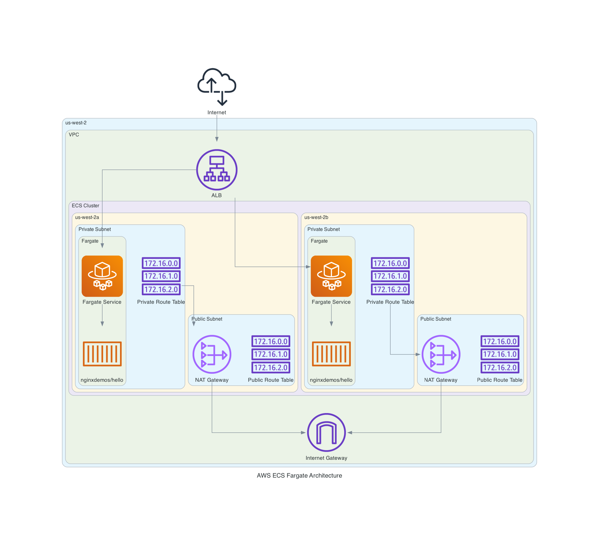

# nginx-aws-app
A simple app running on nginx docker container hosted on AWS ECS Fargate cluster.

## Prerequisites
AWS access key and secret key needs to be generated from your AWS account and either:
 1. Stored as [Github Action Repository Secrets](https://docs.github.com/en/actions/security-for-github-actions/security-guides/using-secrets-in-github-actions) ( `AWS_ACCESS_KEY_ID` and `AWS_SECRET_ACCESS_KEY`) if you want to use Github Actions to automate the deployment process. The AWS region should also be set in the `.github/workflows/deploy.yml` file as `AWS_REGION`.
 2. Configured in your local machine using the AWS CLI as below if you want to do the deployment from your local machine:
```sh
    $ aws configure
        AWS Access Key ID [None]: <your_access_key_id>
        AWS Secret Access Key [None]: <your_secret_access_key>
        Default region name [None]: us-west-2
        Default output format [None]: json
```

## Deploying the App from your local machine
After configuring the AWS credentials, run the following command to deploy the app:
```sh
    terraform init && \
    terraform plan && \
    terraform apply --auto-approve
```

## Accessing the App
After the app is deployed, you can access it using the DNS name of the load balancer which will be displayed as an output after the `terraform apply` command is run. The DNS name will look something like this:
```
    http://a1b2c3d4e5f6g7h8i9j0k1l2m3n4o5p6q7r8s9t0-1234567890.us-west-2.elb.amazonaws.com
```
You can also find the DNS name in the AWS console under the EC2 service -> Load Balancers. Click on the load balancer and you will see the DNS name in the description tab.

## Cleaning Up 
After you are done testing, run the following command to destroy the resources created by terraform:
```sh
    terraform destroy --auto-approve
```

## Architecture

[](aws_ecs_fargate_architecture.png)

The architecture diagram was generated using `graphviz` and the `diagrams` python library. Run the following command to generate the diagram on a MacOS machine:
```sh
    brew install graphviz && \
    python3 -m venv env && \
    source env/bin/activate && \
    pip install -r requirements.txt && \
    python diagram.py
```

## Opportunities for Improvement
1. Serve content on port 443 using HTTPs instead of on port 80.
2. Instead of using AWS access key and secet key to authenticate to the AWS account, use [GitHub OIDC](https://docs.github.com/en/actions/deployment/security-hardening-your-deployments/using-openid-connect-to-authenticate-to-aws) to authenticate to AWS. This will remove the need to store AWS access key and secret key in GitHub secrets thereby reducing the attack surface in case the secrets get comprmised since OIDC tokens are short-lived.
3. Instead of directly using terarform `resource` blocks, use terraform modules to create reusable components. This will make the code more modular and easier to maintain.
4. Use [Terraform Cloud](https://www.terraform.io/cloud) or `s3` backend to manage the terraform state file instead of storing it in a local file. This will make it easier to collaborate with other team members and manage the state file.
5. ...

## References
Some of the terraform code used in this repo was adapted from "[Using Terraform and Fargate to create Amazon’s ECS](https://medium.com/@olayinkasamuel44/using-terraform-and-fargate-to-create-amazons-ecs-e3308c1b9166)"
